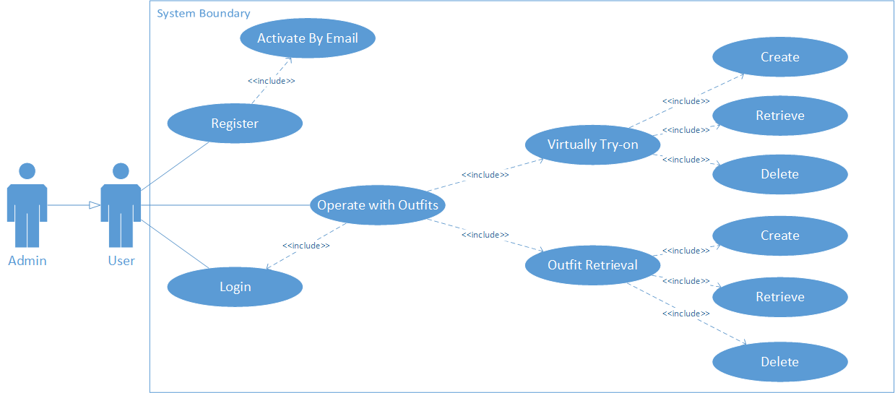
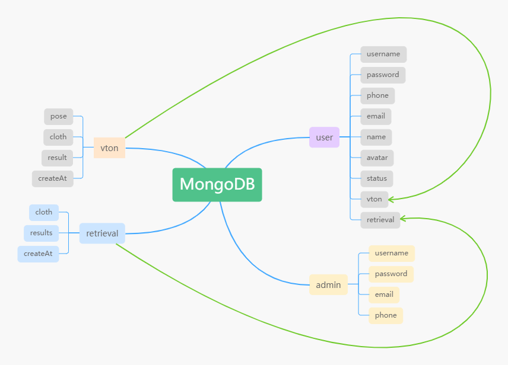

# OutfitApp-Frontend
The frontend of the final year project Custom Outfit App.

[](https://gitlab.com/Sam1224/take-away-as-test/commits/master)

[](https://gitlab.com/Sam1224/take-away-as-test/badges/master/coverage.svg?job=coverage)

- [Github](https://github.com/Sam1224/OutfitApp-Frontend)
- [Gitlab](https://gitlab.com/Sam1224/outfitapp-frontend-test)
- [Gitlab CI/CD Pipeline](https://gitlab.com/Sam1224/outfitapp-frontend-test/pipelines)

- Table Of Contents
  - [OutfitApp-Frontend](#outfitapp-frontend)
    * [Basic Information](#basic-information)
    * [Environment](#environment)
    * [Usage](#usage)
    * [Description of Functionality](#description-of-functionality)
    * [UML Diagrams](#uml-diagrams)
    * [Database Schemas](#database-schemas)
    * [Git Approach](#git-approach)
    * [UX/DX Approach](#ux-dx-approach)
    * [References](#references)

## Basic Information
- ID: 20086454
- Name: Qianxiong Xu
- Major: BSc (Hons) in Software Systems Practice Year 1

## Environment
- OS: Windows 10
- Node: v10.16.3

## Usage
- Clone:
```
git clone https://github.com/Sam1224/OutfitApp-Frontend.git
```
- Configure:
```
cd <your_dir>
npm install
```
- Run:
```
npm run start
```
- Test(Cypress):
```
npm run cypress:open
```

## Description of Functionality
- Client:
  >The client can be divided into 2 parts: `UI for frontend`and `UI for backend`.
  - Urls:
    - [Github](https://github.com/Sam1224/OutfitApp-Frontend)
    - [Gitlab(with CI/CD)](https://gitlab.com/Sam1224/outfitapp-frontend-test)
  - Functions:
    >This section only shows a brief description of functionalities of the client.
    - UI for frontend:
      - Home
        - Access:
          - Visit: https://outfitapp-sam.firebaseapp.com/home
        - Function:
          - Shows sliders of virtual try-on samples and outfits retrieval samples.
      - Login:
        - Access:
          - Visit: https://outfitapp-sam.firebaseapp.com/login
        - Function:
          - Allows users to login.
      - Register
        - Access:
          - Visit: https://outfitapp-sam.firebaseapp.com/register
        - Function:
          - Allows users to register.
      - Personal Information:
        - Access:
          - Visit: https://outfitapp-sam.firebaseapp.com/login
          - Login
          - Visit: https://outfitapp-sam.firebaseapp.com/personal
        - Function:
          - Allows users to turn to edit information page.
          - Allows users to turn to vton list page.
          - Allows users to turn to retrieval list page.
      - Edit Personal Information:
        - Access:
          - Visit: https://outfitapp-sam.firebaseapp.com/login
          - Login
          - Visit: https://outfitapp-sam.firebaseapp.com/personal
          - Click on the edit icon.
        - Function:
          - Allows users to modify personal information, including basic information and changing avatar.
      - VTON List:
        - Access:
          - Visit: https://outfitapp-sam.firebaseapp.com/login
          - Login
          - Visit: https://outfitapp-sam.firebaseapp.com/vton-list
        - Function:
          - Allows users to view all personal vton records and can delete them.
      - VTON:
        - Access:
          - Visit: https://outfitapp-sam.firebaseapp.com/login
          - Login
          - Visit: https://outfitapp-sam.firebaseapp.com/vton
        - Function:
          - Allows users to choose cloth image and pose image to virtual try on.
      - VTON DIY:
        - Access:
          - Visit: https://outfitapp-sam.firebaseapp.com/login
          - Login
          - Visit: https://outfitapp-sam.firebaseapp.com/vton-diy
        - Function:
          - Allows users to upload cloth image and pose image to virtual try on.
      - Retrieval List:
        - Access:
          - Visit: https://outfitapp-sam.firebaseapp.com/login
          - Login
          - Visit: https://outfitapp-sam.firebaseapp.com/retrieval-list
        - Function:
          - Allows users to view all personal retrieval records and can delete them.
      - Retrieval:
        - Access:
          - Visit: https://outfitapp-sam.firebaseapp.com/login
          - Login
          - Visit: https://outfitapp-sam.firebaseapp.com/retrieval
        - Function:
          - Allows users to upload cloth image to retrieve similar cloth images from the DeepFashion Database.
    - UI for backend:
      - Login
        - Access:
          - Visit: https://outfitapp-sam.firebaseapp.com/admin
        - Function:
          - Allows admins to login, using their accounts or use 3rd party accounts to login, including Google, Github, Gitlab, Gitee, Bitbucket and Weibo.
      - Index Page
        - Access:
          - Visit: https://outfitapp-sam.firebaseapp.com/admin
          - Login.
        - Function:
          - Shows a slider.
      - Drawer
        - Access:
          - Visit: https://outfitapp-sam.firebaseapp.com/admin
          - Click: The arrow on the left top corner.
        - Function:
          - Shows some basic information of this app.
      - Users List
        - Access:
          - Visit: https://outfitapp-sam.firebaseapp.com/admin
          - Login.
          - Click on Users in the navigation bar.
        - Function:
          - Shows a table with users in the database and allows users to delete records.
          - Shows a childrow with the basic information of a user when '+' is clicked
      - Add User
        - Access:
          - Visit: https://outfitapp-sam.firebaseapp.com/admin
          - Login.
          - Click on Users in the navigation bar.
          - Click on Add User button at the bottom.
        - Function:
          - Allows admin to add a new user.
      - Edit user
        - Access:
          - Visit: https://outfitapp-sam.firebaseapp.com/admin
          - Login.
          - Click on Users in the navigation bar.
          - Click on Edit icon in a row of the users table.
        - Function:
          - Allows admin to modify the basic information and the avatar of a user.
      - Users List
        - Access:
          - Visit: https://outfitapp-sam.firebaseapp.com/admin
          - Login.
          - Click on Users in the navigation bar.
        - Function:
          - Shows a table with users in the database and allows users to delete records.
          - Shows a childrow with the basic information of a user when '+' is clicked
      - Add User
        - Access:
          - Visit: https://outfitapp-sam.firebaseapp.com/admin
          - Login.
          - Click on Users in the navigation bar.
          - Click on Add User button at the bottom.
        - Function:
          - Allows admin to add a new user.
      - Edit user
        - Access:
          - Visit: https://outfitapp-sam.firebaseapp.com/admin
          - Login.
          - Click on Users in the navigation bar.
          - Click on Edit icon in a row of the users table.
        - Function:
          - Allows admin to modify the basic information and the avatar of a user.

- Server:
  - Urls:
    - [Github](https://github.com/Sam1224/OutfitApp-Backend)
    - [Gitlab(with CI/CD)](https://gitlab.com/Sam1224/outfitapp-backend-test)
  - Functions:
    >There are 4 routers in the server side.
    - user:
      - GET     -     findAll
      - GET     -     findOne
      - POST    -     addUser
      - PUT     -     updateUser
      - POST    -     login
      - GET     -     getToken
      - DELETE  -     deleteUser
      - POST    -     addVton
      - DELETE  -     deleteVton
      - POST    -     addRetrieval
      - DELETE  -     deleteRetrieval
    - admin:
      - GET     -     findAll
      - GET     -     findOne
      - POST    -     addAdmin
      - PUT     -     updateAdmin
      - DELETE  -     deleteAdmin
      - PUT     -     updateGoods
      - POST    -     login
      - GET     -     getToken
    - file:
      - GET     -     getImage
      - POST    -     upload
      - POST    -     uploadmul
    - oauth:
      - POST    -     getGithubToken
      - POST    -     getGitlabToken
      - POST    -     getGiteeToken
      - POST    -     getBitbucketToken
      - POST    -     getWeiboToken

- Frameworks used:
  - Client:
    - Vue CLI
    - Vue-Router
    - Vuex
    - Node
  - Server:
    - MongoDB
    - Vue.js
    - Express
    - Node
    - Docker
    - Flask

- 3rd party APIs:
  >This application uses `7` 3rd party APIs in total, they are listed as follow.
  - OAuth2 Logins:
    - Google OAuth2 Login.
    - Github OAuth2 Login.
    - Gitlab OAuth2 Login.
    - Gitee OAuth2 Login.
    - Bitbucket OAuth2 Login.
    - Weibo OAuth2 Login.

## UML Diagrams
- Use case diagrams:
  - Frontend UI of client:
  
  - Backend UI of client:
  
  
- Sequence diagrams:
  >There are many sequence diagrams, you can find details in my report.

## Database Schemas
>There are `4 nested` schemas adopted in the server of this application.

| Data Model | Schema |
| ---------- | ------ |
| User | [User Schema](https://github.com/Sam1224/OutfitApp-Backend/tree/master/models/user.js) |
| Admin | [Admin Schema](https://github.com/Sam1224/OutfitApp-Backend/tree/master/models/seller.js) |
| Vton | [Vton Schema](https://github.com/Sam1224/OutfitApp-Backend/tree/master/models/vton.js) |
| Retrieval | [Retrieval Schema](https://github.com/Sam1224/OutfitApp-Backend/tree/master/models/retrieval.js) |



## Git Approach
- Both of the client and server adopts `Git` locally, while using `Github` and also `Gitlab` as the remote repositories for management.
- The status of the repositories are all `public`.
- Please refer to the `commits` for my commiting records.
- The urls of repositories are listed as follow:
  - Client:
    - [Github](https://github.com/Sam1224/OutfitApp-Frontend)
    - [Gitlab(with CI/CD)](https://gitlab.com/Sam1224/outfitapp-frontend-test)
  - Server:
    - [Github](https://github.com/Sam1224/OutfitApp-Backend)
    - [Gitlab(with CI/CD)](https://gitlab.com/Sam1224/outfitapp-backend-test)

## UX/DX Approach
- UX
  - Use a great `navigation bar` in the backend UI of the client.
  - Use plenty of complex UI elements provided by [ElementUI](https://element.eleme.cn/#/en-US/component/installation) and others, e.g. drawer, upload, loading, message box, carousel, collapse, etc.
  - According to the [UI Design Guidelines](https://www.interaction-design.org/literature/article/user-interface-design-guidelines-10-rules-of-thumb), most of the guidelines are considered.
  - According to the [Web Design Rules](https://sharpened.com/web_design_rules), all the rules are met.
- DX
  - Data validation strategy is adopted, almost every table in this application is configured with `rules` for validation.
  - The `Git approach` is explained in the previous section.
  - Automated testing:
    - Client:
      - Cypress:
        - [Cypress Dashboard](https://dashboard.cypress.io/projects/c5k43w/runs)
    - Server:
      - Mocha, Chai and lodash:
        - There are `49` test cases in total.
  - Many advanced options of Vue have been used, e.g. vue-router(history mode), vuex, filter, transition, slots, etc.
  - CI/CD:
    - Both of the client and server achieve the goal of CI/CD with the uses of `Gitlab`:
      - Client:
        - Staging:
          - Frontend UI: https://outfitapp-sam-staging.firebaseapp.com
          - Backend UI: https://outfitapp-sam-staging.firebaseapp.com/admin
        - Production:
          - Frontend UI: https://outfitapp-sam-prod.firebaseapp.com
          - Backend UI: https://outfitapp-sam-staging.firebaseapp.com/admin
      - Server:
        - Staging:
          - https://outfitapp-sam-staging.herokuapp.com
        - Production:
          - https://outfitapp-sam-prod.herokuapp.com

## References
- Develop:
  - [Mr. David Drohan's course](https://tutors-design.netlify.com/course/wit-wad-2-2019.netlify.com)
  - [Vue.js](https://vuejs.org/index.html)
  - [Vue CLI](https://cli.vuejs.org/)
  - [Vue Router](https://router.vuejs.org/)
  - [Vuex](https://vuex.vuejs.org/guide/)
  - [Node.js](https://nodejs.org/zh-cn/)
  - [Node's official docs](https://nodejs.org/zh-cn/docs/)
  - [sha1](https://www.npmjs.com/package/js-sha1)
  - [jsonwebtoken](https://www.npmjs.com/package/jsonwebtoken)
  - [ElementUI](https://element.eleme.cn/#/en-US/component/installation)
  - [A blog about ElementUI - multiple image uploading](https://segmentfault.com/a/1190000015834181)
  - [vue-tables-2](https://github.com/matfish2/vue-tables-2)
  - [better-scroll](https://github.com/ustbhuangyi/better-scroll)

- MongoDB:
  - [MongoDB](https://www.mongodb.com/)
  - [MongoDB Atlas](https://www.mongodb.com/cloud/atlas)
  - [Mongoose](https://mongoosejs.com/)
  - [Mongoose docs](http://www.nodeclass.com/api/mongoose.html#quick_start)
  - [A blog of MongoDB about Schema and Model](https://www.jianshu.com/p/29c55aae3d6f)

- Test:
  - [mocha](https://mochajs.org/)
  - [A blog about Mocha](http://www.ruanyifeng.com/blog/2015/12/a-mocha-tutorial-of-examples.html)
  - [lodash](https://lodash.com/)
  - [eslint](https://eslint.org/)
  - [A blog about jwt](http://www.ruanyifeng.com/blog/2018/07/json_web_token-tutorial.html)
  - [A blog about jwt](https://www.jb51.net/article/162523.htm)
  - [A blog about jwt](https://segmentfault.com/a/1190000014062679?utm_source=tag-newest)
  - [chai](https://www.chaijs.com/)
  - [Mongodb-Memory-Server](https://github.com/nodkz/mongodb-memory-server)
  - [supertest](https://github.com/visionmedia/supertest)
  - [nyc](https://github.com/istanbuljs/nyc)
  - [nock](https://github.com/nock/nock)
  - [Postman](https://www.getpostman.com/)
  - [local-web-server](https://www.npmjs.com/package/local-web-server)
  - [cypress-file-upload](https://github.com/abramenal/cypress-file-upload)

- OAuth2:
  - [JustAuth](https://github.com/justauth/JustAuth)
  - [A blog about Google OAuth2](https://www.cnblogs.com/zousaili/p/9406886.html)
  - [A blog about Google OAuth2](https://www.cnblogs.com/Oopspw/p/10063241.html)
  - [A blog about OAuth2](https://www.gaojianjian.com/blog/2019-01-10-GitHub-Google-Facebook-Weibo-Third-Party-Login)
  - [A blog about Github OAuth2](https://cloud.tencent.com/developer/article/1423512)
  - [google-api-javascript-client](https://github.com/google/google-api-javascript-client)
  - [A repository about OAuth2 login](https://github.com/hehaibao/h-blog)

- CI/CD:
  - [A blog about Firebase Hosting Deployment Automation with Gitlab CI](https://medium.com/@rambabusaravanan/firebase-hosting-deployment-automation-with-gitlab-ci-f3fad9130d62)
  - [A blog about Automatically deploy to Firebase with Gitlab CI](https://medium.com/evenbit/automatically-deploy-to-firebase-with-gitlab-ci-546f194c44d8)
  - [Firebase - Share project resources across multiple sites](https://firebase.google.com/docs/hosting/multisites)

- Others:
  - [UI Design Guidelines](https://www.interaction-design.org/literature/article/user-interface-design-guidelines-10-rules-of-thumb)
  - [Web Design Rules](https://sharpened.com/web_design_rules)
  - [TOC generator](https://ecotrust-canada.github.io/markdown-toc/)
